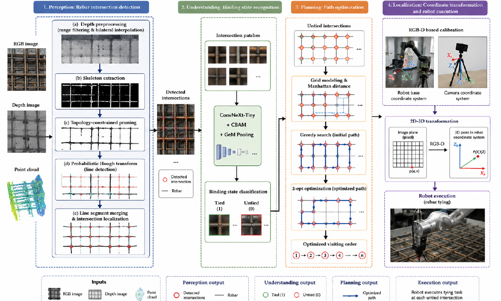
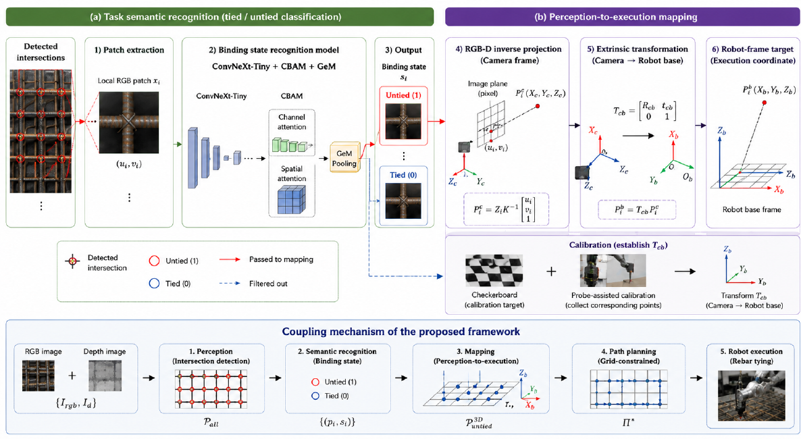
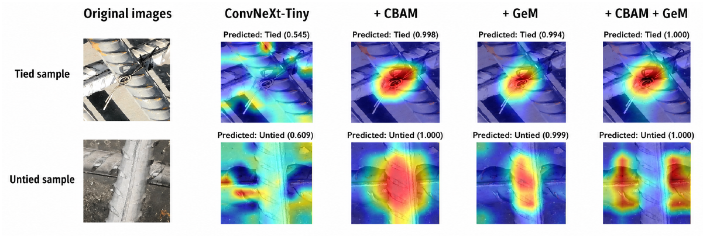
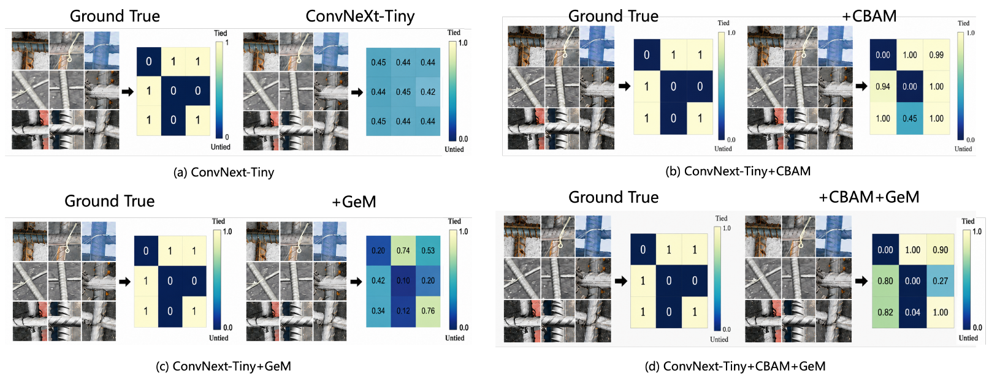
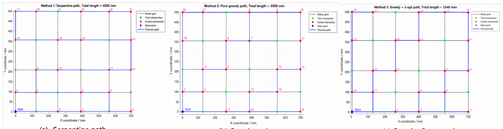
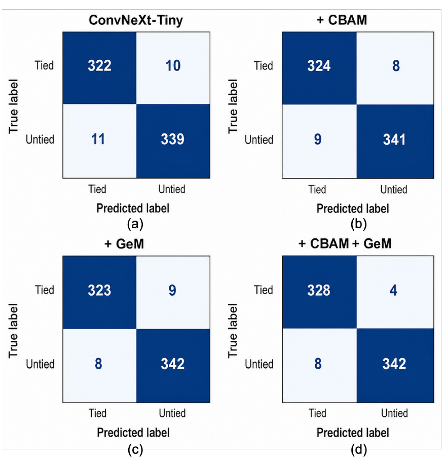

<h1 align="center">Task-Oriented RGB-D Perception and Rebar-Tying State Recognition</h1>

<p align="center">
  Code companion for <br>
  <strong>Task-Oriented RGB-D Perception and Execution Planning Framework for Autonomous Robotic Rebar Tying</strong>
</p>

<p align="center">
  Python | PyTorch | ConvNeXt-Tiny | CBAM | GeM | Grad-CAM
</p>

<p align="center">
  
</p>

## Overview

This repository contains the code used for the manuscript **"Task-Oriented RGB-D Perception and Execution Planning Framework for Autonomous Robotic Rebar Tying"**.

The complete framework connects RGB-D rebar intersection perception, tied/untied state recognition, robot-frame coordinate mapping, and grid-constrained execution planning. This repository focuses on the image-based semantic recognition experiments and related visualization tools.

| Item | Description |
| --- | --- |
| Task | Classify rebar intersections as tied or untied |
| Core model | ConvNeXt-Tiny enhanced with CBAM attention and GeM pooling |
| Utilities | Dataset splitting, interactive cropping, training, evaluation, result summary, Grad-CAM |
| Included data | Small demo images and manuscript figures |
| Excluded data | Full raw dataset, trained checkpoints, virtual environments, and heavy run outputs |

## Contents

- [Paper Figures](#paper-figures)
- [Key Results](#key-results)
- [Repository Structure](#repository-structure)
- [Installation](#installation)
- [Data Layout](#data-layout)
- [Interactive Cropping](#interactive-cropping)
- [Training](#training)
- [Evaluation and Visualization](#evaluation-and-visualization)
- [Notes for Submission](#notes-for-submission)
- [Citation](#citation)

## Paper Figures

### Semantic Recognition and Mapping

The recognition module classifies cropped intersection patches as tied or untied, filters tied intersections from the executable task set, and maps retained untied targets into the robot coordinate frame.

<p align="center">
  
</p>

### Recognition Interpretability

Grad-CAM and probability heatmaps show how CBAM and GeM improve attention localization and prediction confidence for fine-grained tied/untied recognition.

<table>
  <tr>
    <td width="50%">
      
    </td>
    <td width="50%">
      
    </td>
  </tr>
  <tr>
    <td align="center"><strong>Grad-CAM comparison</strong></td>
    <td align="center"><strong>Prediction probability heatmaps</strong></td>
  </tr>
</table>

### Execution Planning

Untied intersections are retained as executable task nodes and visited using grid-constrained path optimization.

<p align="center">
  
</p>

## Key Results

The manuscript reports the following performance for the ConvNeXt-Tiny model enhanced with CBAM attention and GeM pooling:

| Metric | Value |
| --- | ---: |
| Accuracy | 98.24% |
| Precision | 98.84% |
| F1-score | 98.28% |

Confusion matrices for the baseline and ablation variants are shown below.

<p align="center">
  
</p>

## Repository Structure

```text
.
├── assets/                  # Manuscript figures and lightweight README images
├── data/                    # Local data placeholder; full dataset is not tracked
├── examples/                # Small demo inputs
├── results/                 # Lightweight result figures and tables
├── src/
│   ├── dataset_utils.py      # Training, evaluation, metrics, and plotting utilities
│   ├── model_ablation.py     # ConvNeXt + CBAM/GeM model components
│   ├── train_experiment.py   # Recommended unified training entry point
│   ├── split_dataset.py      # Train/val/test splitting utility
│   ├── gradcam_batch_visualize_final.py
│   ├── summarize_results.py
│   └── ...
└── requirements.txt
```

## Installation

Create a Python environment and install the dependencies:

```bash
python -m venv .venv
source .venv/bin/activate
pip install -r requirements.txt
```

If you train with CUDA, install the PyTorch build that matches your GPU driver and CUDA version.

## Data Layout

The training code expects an ImageFolder-style dataset:

```text
data/rebar_dataset/
├── train/
│   ├── tied/
│   └── untied/
├── val/
│   ├── tied/
│   └── untied/
└── test/
    ├── tied/
    └── untied/
```

If you start from cropped tied/untied samples, organize them as:

```text
data/rebar_crops/
├── tied/
└── untied/
```

Then split them into train, validation, and test sets:

```bash
python src/split_dataset.py \
  --src-dir data/rebar_crops \
  --dst-dir data/rebar_dataset \
  --train-ratio 0.6 \
  --val-ratio 0.2
```

## Interactive Cropping

The interactive crop tool extracts tied and untied rebar intersection patches from raw images:

```bash
python src/main.py \
  --input-dir data/raw_images \
  --output-dir data/rebar_crops \
  --crop-size 224 \
  --padding 10
```

Controls:

| Key | Action |
| --- | --- |
| Drag | Select an intersection patch |
| `t` | Save as tied |
| `u` | Save as untied |
| `n` / `p` | Next / previous image |
| `z` | Undo the last displayed annotation |
| `q` or `Esc` | Quit |

## Training

The recommended entry point is `src/train_experiment.py`.

Train the proposed ConvNeXt + CBAM + GeM model:

```bash
python src/train_experiment.py \
  --model convnext_cbam_gem \
  --data-dir data/rebar_dataset \
  --output-dir runs/convnext_cbam_gem \
  --epochs 50 \
  --batch-size 32
```

Train common baselines:

```bash
python src/train_experiment.py --model resnet18 --data-dir data/rebar_dataset --output-dir runs/resnet18
python src/train_experiment.py --model efficientnet_b0 --data-dir data/rebar_dataset --output-dir runs/efficientnet_b0
python src/train_experiment.py --model densenet121 --data-dir data/rebar_dataset --output-dir runs/densenet121
python src/train_experiment.py --model mobilenetv3_small --data-dir data/rebar_dataset --output-dir runs/mobilenetv3_small
python src/train_experiment.py --model convnext_tiny --data-dir data/rebar_dataset --output-dir runs/convnext_tiny
```

Train ablation variants:

```bash
python src/train_experiment.py --model convnext_cbam --data-dir data/rebar_dataset --output-dir runs/convnext_cbam
python src/train_experiment.py --model convnext_gem --data-dir data/rebar_dataset --output-dir runs/convnext_gem
python src/train_experiment.py --model convnext_cbam_gem_head --data-dir data/rebar_dataset --output-dir runs/convnext_cbam_gem_head
```

Each run writes metrics and figures to the selected output directory:

| Output | Purpose |
| --- | --- |
| `best_model.pth` | Best validation checkpoint |
| `history.csv` | Epoch-level training history |
| `result.json` | Test metrics |
| `loss_curve.png`, `acc_curve.png` | Training curves |
| `confusion_matrix.png` | Test confusion matrix |
| `roc_curve.png`, `pr_curve.png` | ROC and precision-recall curves |
| `classification_report.txt` | Class-level report |

## Evaluation and Visualization

Summarize multiple trained models:

```bash
python src/summarize_results.py \
  --runs-dir runs \
  --save-dir results/runs_summary
```

Generate Grad-CAM panels from a trained checkpoint:

```bash
python src/gradcam_batch_visualize_final.py \
  --checkpoint runs/convnext_cbam_gem/best_model.pth \
  --input examples/test_images \
  --output-dir gradcam_outputs \
  --use-cbam \
  --use-gem
```

The Grad-CAM script exports the original image, heatmap, overlay, thresholded mask, contour visualization, and a combined panel for each input image.

## Notes for Submission

- Keep the repository private while the manuscript is under review if the target journal has anonymity or prior-publication constraints.
- Do not upload raw field images, full datasets, trained `.pth` checkpoints, or reviewer-sensitive files unless the journal explicitly requires public availability.
- Add a dataset access statement and a license before making the repository public.

## Citation

If this code is useful for your research, please cite the corresponding manuscript:

```bibtex
@article{ma2026rebarTying,
  title   = {Task-Oriented RGB-D Perception and Execution Planning Framework for Autonomous Robotic Rebar Tying},
  author  = {Ma, Zhanguo and Fan, Shicheng and Sheikder, Chandan and Yin, Zhiwei and He, Haotong and Liu, Pengyang and Yang, Guan},
  year    = {2026},
  note    = {Manuscript}
}
```

## Contributors

- Chandan Sheikder

## License

No open-source license has been selected yet. Please add a license before making the repository public.
